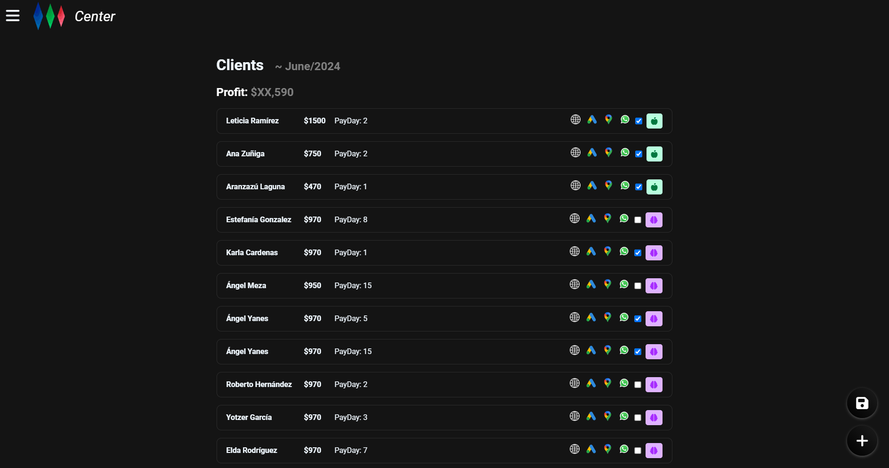

# Persona Center

  

### ¡Bienvenido a **Persona Center**!

**Persona Center** es la herramienta perfecta para gestionar tus clientes y mantener toda la información organizada y accesible. Ideal para pequeñas y medianas empresas que buscan eficiencia y simplicidad.

---

## Características

- **Gestión de Clientes**: Añade, edita y organiza la información de tus clientes.
- **Historial de Actividades**: Mantén un registro de todas las interacciones con tus clientes.
- **Alertas y Recordatorios**: Recibe notificaciones sobre eventos importantes relacionados con tus clientes.
- **Búsqueda y Filtros Avanzados**: Encuentra rápidamente a cualquier cliente usando filtros avanzados.

  

---

## Instalación

1. **Clona el repositorio**:
   ```sh
   git clone https://github.com/tuusuario/PersonaCenter.git
   ```
2. **Instala las dependencias**:
   ```sh
    npm install
    ```
3. **Inicia la aplicación**:
    ```sh
    npm start
    ```
    4. Configura Firebase:
    ```sh
    Crea un proyecto en Firebase y configura las credenciales en el archivo `src/firebase.js`
    ```
---

## Uso

1. Inicio de Sesión
2. Gestión de Clientes
3. Historial de Actividades

---

## Tecnologías

- **React**: Frontend
- **Firebase**: Base de Datos
- **Redux**: Estado Global
- **StyleX**: Estilos

---

## Contribución

1. Realiza un **fork** del proyecto
2. Crea una **rama** para tu contribución
3. Realiza un **pull request**
4. ¡Espera a que tu contribución sea aceptada!